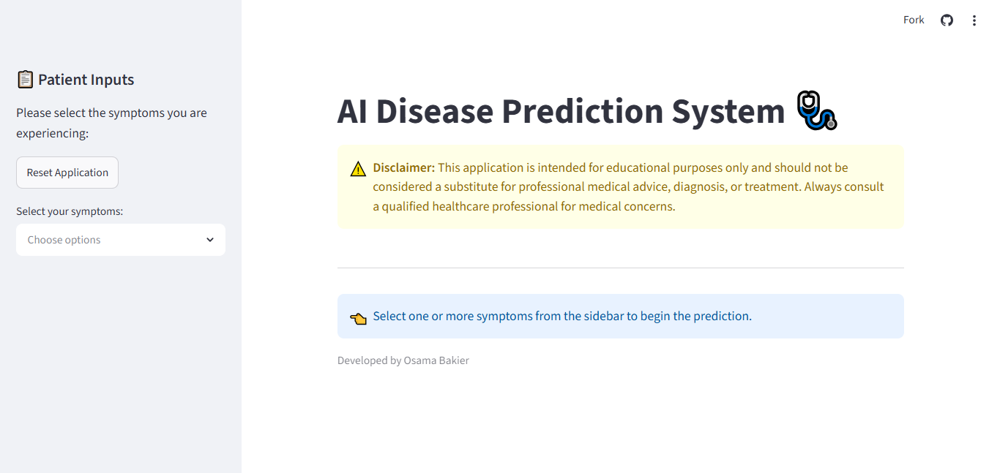
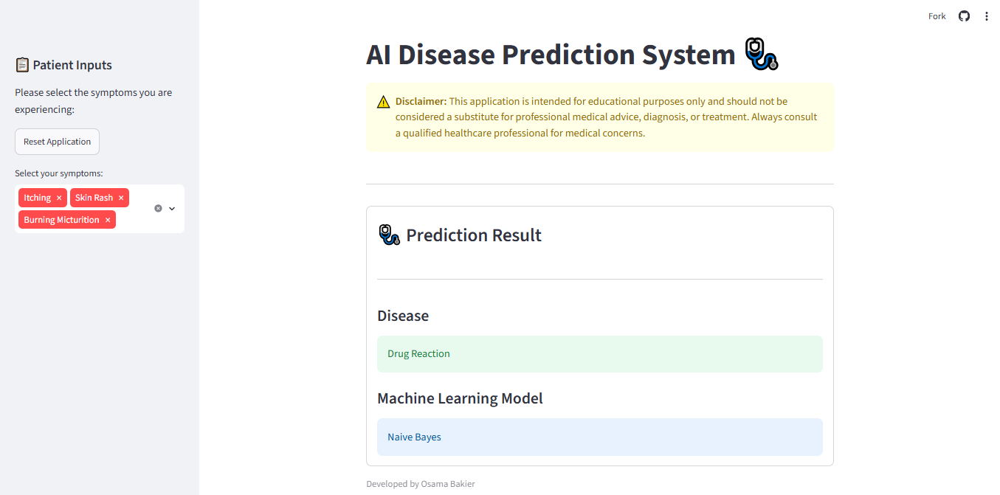

# 🩺 AI Disease Prediction System

An interactive Machine Learning web application that predicts the most likely disease based on user-selected symptoms.

The application is built with Python and Streamlit and uses a trained Naive Bayes model to perform disease prediction in real time.

> ⚠️ This project is developed for educational purposes only and should not be used as a medical diagnostic tool.

## Key Features

- Predict diseases based on selected symptoms.
- Interactive web interface built with Streamlit.
- Machine Learning model trained using Naive Bayes.
- Clean and simple user experience.
- Real-time disease prediction using a trained Naive Bayes model.

## Tech Stack
- Python
- Streamlit
- Scikit-learn
- Pandas
- NumPy

## Live Demo
Check out the live application here: [Disease Prediction App](https://ml-disease-detection.streamlit.app/)

## Project Preview

### Home Page



### Prediction Example



## Project Structure
- data/: Training and testing datasets.
- notebooks/: Jupyter notebooks for data analysis and model training.
- src/: Serialized model files and label encoders (.pkl).
- app.py: The main Streamlit web application.

## How to Run Locally

1. Clone the repository:

```bash
git clone https://github.com/OsamaBakier/disease-prediction-ml.git
cd disease-prediction-ml
```

2. Create and activate a virtual environment:

```bash
python -m venv venv

# Windows:
venv\Scripts\activate

# macOS/Linux:
source venv/bin/activate
```

3. Install requirements:
```bash
pip install -r requirements.txt
```

4. Run the app:

```bash
streamlit run app.py
```

## Author

Developed by **Osama Bakier**

- GitHub: [@OsamaBakier](https://github.com/OsamaBakier)